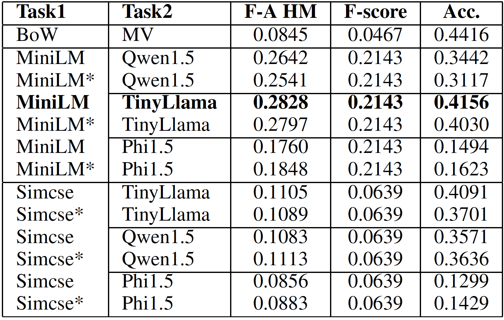
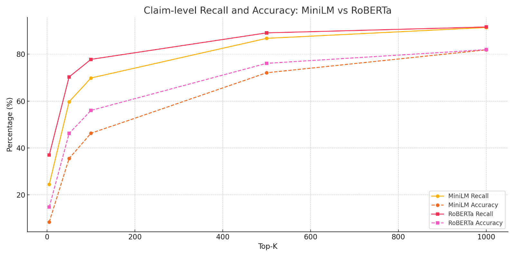

# LLM-NLP Fact-Checking Pipeline

### Multi-Phase Retrieval & Classification for Climate Claims

---

## 📌 Overview

This project implements a **multi-stage fact-checking system** for climate-related claims using:

* Hybrid information retrieval (BM25 + dense embeddings)
* Transformer-based re-ranking
* Prompt-based classification with lightweight LLMs

The system processes **1.2M+ evidence sentences** and classifies claims into:

* `SUPPORTS`
* `REFUTES`
* `NOT_ENOUGH_INFO`
* `DISPUTED`
--
Developed as part of **University of Melbourne**, this project demonstrates a **scalable, modular NLP pipeline for end-to-end retrieval, re-ranking, and classification of large-scale unstructured data**.
---

## 🏗️ System Architecture

### Main Pipeline (Production)

Implemented in:

```
notebooks/main_info_retrieval_pipeline.ipynb
```

### Pipeline Flow

```
Claims → Hybrid Retrieval → Re-ranking → LLM Classification → Final Predictions
```

---

## ⚙️ Core Components

### 1. Preprocessing

* Stage-specific text processing
* Optimised for retrieval and classification

---

### 2. Hybrid Retrieval (Key Contribution)

* **BM25 (Pyserini)** → lexical matching
* **MiniLM bi-encoder (DPR)** → semantic retrieval
* Merge candidates into hybrid pool

✅ Improves recall significantly

---

### 3. Cross-Encoder Re-ranking

* Model: `MiniLM cross-encoder`
* Curriculum learning:

  * Phase 1 → random negatives
  * Phase 2 → hard negatives

✅ Produces top-5 high-quality evidence

---

### 4. LLM-Based Classification

* Models:

  * TinyLlama (best)
  * Qwen1.5
  * Phi-1.5

* Zero-shot prompt-based classification

Handles:

* Conflicting evidence → `DISPUTED`
* Missing evidence → `NOT_ENOUGH_INFO`

---

## ⚠️ Experimental Pipelines (Exploration Only)

Not used in final system due to lower performance.

### Perplexity Filtering

```
notebooks/experiment_perplexity.ipynb
```

### FAISS Retrieval

```
notebooks/experiment_faiss.ipynb
```

### SimCSE Pipeline

```
notebooks/simcse_and_classification.ipynb
```

🔎 Findings:

* SimCSE retrieves semantically relevant but low gold-match evidence
* FAISS filtering lacks robustness
* Hybrid pipeline outperforms alternatives

---

## 📊 Results
### Model Performance Comparison
<p align="center">
  
</p>

**Key Insights:**
- The **Hybrid Retrieval (MiniLM) + TinyLlama** configuration achieves the best overall performance  
- Significant improvement over baseline (**0.08 → ~0.28 F-A score**)  
- Smaller LLMs outperform larger ones when paired with strong retrieval pipelines  
- Demonstrates that **pipeline design > model size**

---

### Retrieval Trade-off (Recall vs Accuracy)
<p align="center">
  
</p>

**Key Insights:**
- Increasing **Top-K** improves recall but introduces noise  
- MiniLM achieves a strong balance between **semantic recall and classification accuracy**  
- RoBERTa provides higher recall but does not translate proportionally to accuracy gains  
- Highlights importance of **re-ranking and evidence filtering**

---

## 📂 Project Structure

```
.
├── notebooks/
│   ├── main_info_retrieval_pipeline.ipynb
│   ├── experiment_faiss.ipynb
│   ├── experiment_perplexity.ipynb
│   ├── simcse_and_classification.ipynb
│   └── eval.py
│
├── data/
│   ├── train-claims.json
│   ├── dev-claims.json
│   └── test-claims-unlabelled.json
│
├── generate_train_dataset/
├── Sim_tools/
├── saved_model/
├── local_data/
├── log/
│
├── README.md
├── LICENSE
```

---

## ⚙️ Setup & Running

### Install Dependencies

```bash
pip install pyserini
pip install transformers sentence-transformers faiss-cpu
pip install nltk
```

---

### Run Pipeline

Open:

```
notebooks/main_info_retrieval_pipeline.ipynb
```

Run sequentially:

* Preprocessing
* Retrieval
* Re-ranking
* Classification

---

### Evaluate

```bash
python eval.py \
  --predictions dev-claims-predictions.json \
  --groundtruth dev-claims.json
```

---

## 📈 Evaluation Metrics

* Evidence Retrieval F1
* Classification Accuracy
* F-A Harmonic Mean

---

## 👥 Contributors

* **Yechen Deng** — Hybrid Retrieval, Cross-encoder re-ranking, LLM classification
* **Zhenyuan He** — SimCSE, FAISS, LLM classification
* **Wen Zhou** — BERTopic, analysis, experiments

---

## 📄 License

This project is licensed under the MIT License.